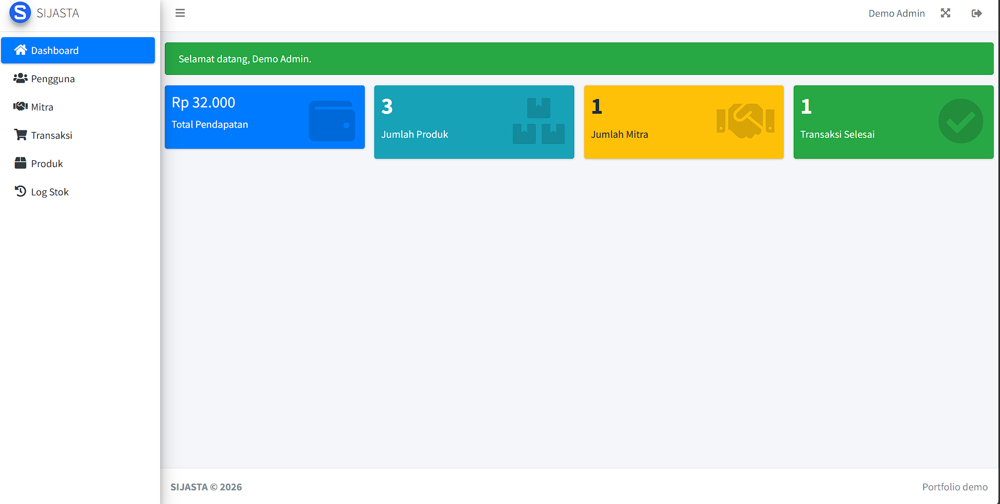
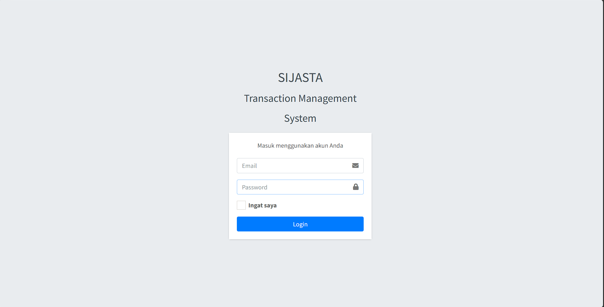
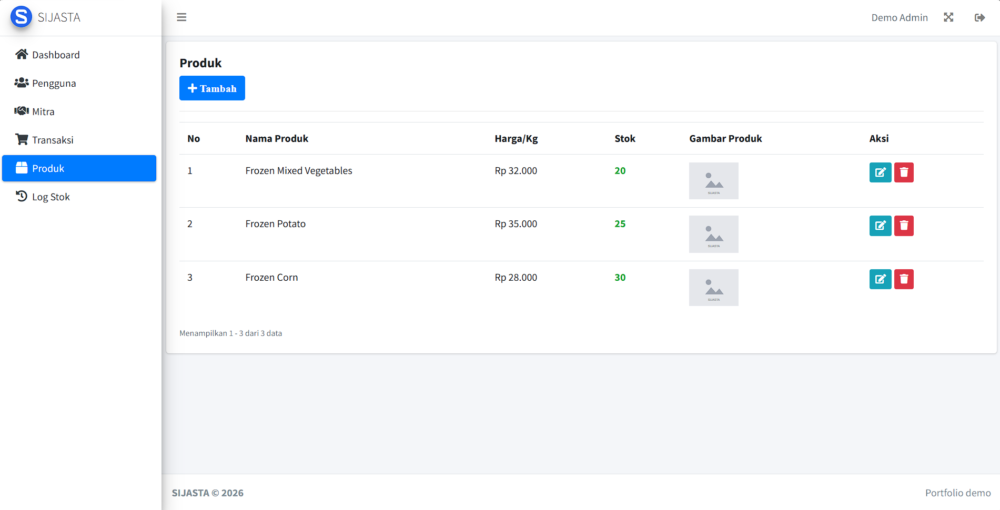
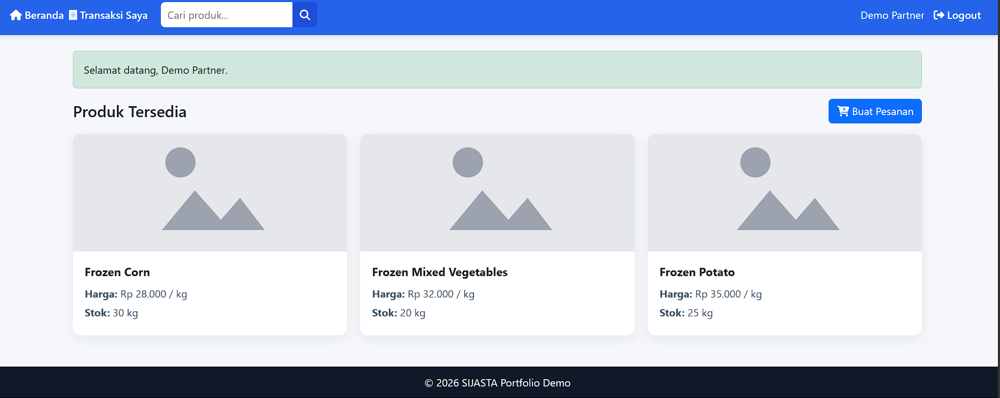
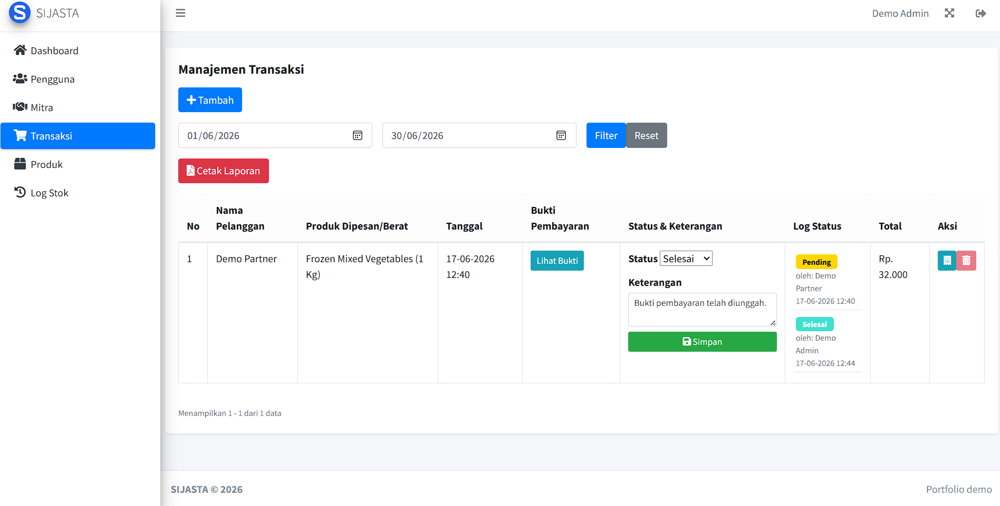
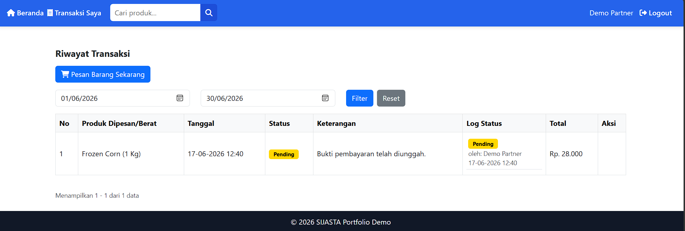
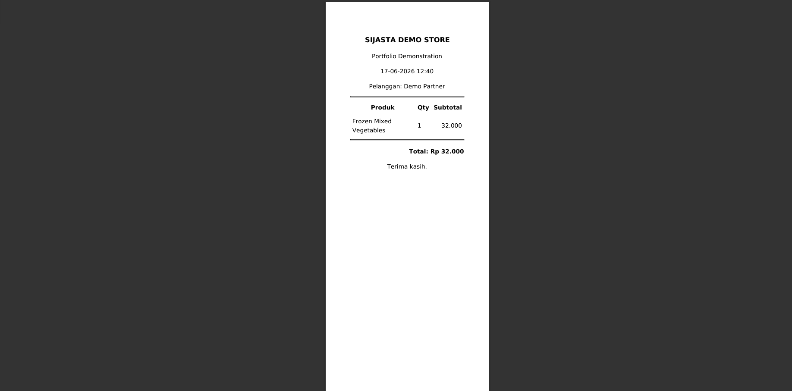
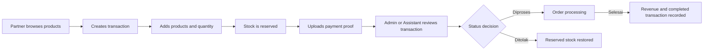
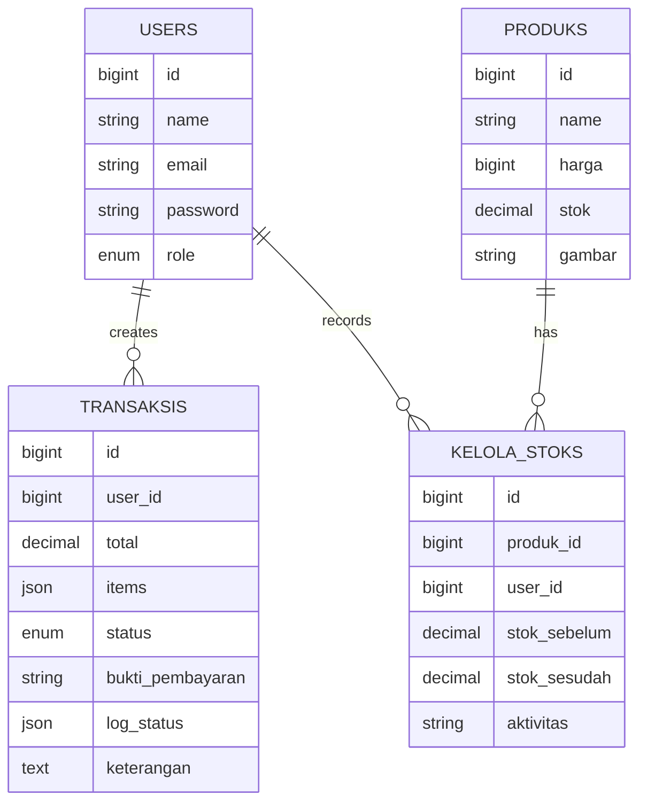

# SIJASTA — Transaction Management System

<p align="center">
  <strong>A role-based transaction, inventory, stock, and reporting application built with Laravel 10 and MySQL.</strong>
</p>

<p align="center">
  <a href="https://github.com/sulthanrhnn/sijasta-transaction-management/actions/workflows/tests.yml">
    
  </a>
  
  
  
  
</p>

## Overview

SIJASTA is a portfolio demonstration of a web-based transaction and inventory management system. It supports separate workflows for administrators, assistants, and business partners while maintaining product stock, transaction status history, payment evidence, and printable reports.

This public version uses **dummy data only** and has been sanitized for portfolio use.

## Application Preview

### Admin Dashboard

<p align="center">
  
</p>

<table>
  <tr>
    <td width="50%" align="center"><strong>Login</strong></td>
    <td width="50%" align="center"><strong>Product Management</strong></td>
  </tr>
  <tr>
    <td></td>
    <td></td>
  </tr>
  <tr>
    <td width="50%" align="center"><strong>Partner Dashboard</strong></td>
    <td width="50%" align="center"><strong>Transaction Management</strong></td>
  </tr>
  <tr>
    <td></td>
    <td></td>
  </tr>
  <tr>
    <td width="50%" align="center"><strong>Partner Transaction History</strong></td>
    <td width="50%" align="center"><strong>Printable Receipt</strong></td>
  </tr>
  <tr>
    <td></td>
    <td></td>
  </tr>
</table>

## Main Features

- Role-based authentication and authorization for **Admin**, **Assistant**, and **Partner** users.
- User and partner account management.
- Product, price, image, and stock management.
- Stock-change history with the responsible user and before/after quantities.
- Partner product catalogue, search, ordering, and transaction history.
- Automatic stock reservation when products are added to a transaction.
- Stock restoration when an item is removed or a transaction is rejected.
- Transaction statuses: `pending`, `diproses`, `selesai`, and `ditolak`.
- Transaction status audit trail with actor and timestamp.
- Private payment-proof storage with authorization checks.
- Date-range filtering and PDF transaction reports.
- Printable thermal-style transaction receipts.
- Pagination for operational tables.
- Automated authentication and role-access tests with GitHub Actions.

## User Roles

| Role | Main Access |
|---|---|
| **Admin** | Dashboard, users, partners, products, stock logs, transactions, reports, and status updates |
| **Assistant** | Dashboard, partners, products, stock logs, transactions, reports, and status updates |
| **Partner** | Product catalogue, product search, ordering, payment-proof upload, transaction history, and receipts |

## Technology Stack

| Area | Technology |
|---|---|
| Backend | PHP 8.1+, Laravel 10 |
| Database | MySQL |
| Frontend | Blade, Bootstrap, AdminLTE, JavaScript |
| PDF | Laravel DomPDF |
| Alerts | SweetAlert |
| Testing | PHPUnit, Laravel HTTP tests |
| CI | GitHub Actions |

## Transaction Workflow



## Simplified Data Model



Transaction line items are stored as a JSON snapshot so historical product names, quantities, prices, and subtotals remain available even when the product catalogue changes.

## Local Installation

### Requirements

- PHP 8.1 or newer
- Composer
- MySQL or MariaDB
- Required PHP extensions: `mbstring`, `fileinfo`, `pdo_mysql`, and `dom`

### Setup

```bash
git clone https://github.com/sulthanrhnn/sijasta-transaction-management.git
cd sijasta-transaction-management
composer install
```

Create the environment file:

**Windows PowerShell**

```powershell
Copy-Item .env.example .env
```

**Linux, macOS, or Git Bash**

```bash
cp .env.example .env
```

Generate the application key:

```bash
php artisan key:generate
```

Create an empty MySQL database named:

```text
sijasta_portfolio
```

Update the database section in `.env`:

```env
DB_CONNECTION=mysql
DB_HOST=127.0.0.1
DB_PORT=3306
DB_DATABASE=sijasta_portfolio
DB_USERNAME=root
DB_PASSWORD=
```

Run migrations and seed the demonstration data:

```bash
php artisan migrate:fresh --seed
```

Start the development server:

```bash
php artisan serve
```

Open `http://127.0.0.1:8000` in your browser.

## Demo Accounts

All seeded accounts use dummy data.

| Role | Email | Password |
|---|---|---|
| Admin | `admin@example.com` | `password` |
| Assistant | `assistant@example.com` | `password` |
| Partner | `partner@example.com` | `password` |

## Running Tests

```bash
php artisan test
```

The repository also runs the test suite automatically on every push and pull request to `main` through GitHub Actions.

## Security Notes

- `.env`, logs, sessions, caches, uploaded payment proofs, and local dependencies are excluded from Git.
- Payment evidence is stored on Laravel's private local disk and served only after an authorization check.
- Uploaded images are validated by MIME type and size.
- Transaction ownership is checked before partners can view or modify a transaction.
- Stock operations use database transactions and row locking to reduce race-condition risks.
- Public demonstration credentials must never be reused in production.

For vulnerability reports, see [SECURITY.md](SECURITY.md).

## Project Structure

```text
app/                    Controllers, middleware, models, and services
database/               Migrations, factories, and demonstration seeders
docs/screenshots/       Portfolio screenshots
public/                  Public assets and application entry point
resources/views/         Blade templates
routes/web.php           Web routes and role-protected endpoints
tests/                   Authentication and role-access tests
.github/workflows/       Continuous-integration workflow
```

## Portfolio Context

This repository demonstrates practical experience with:

- Laravel MVC development
- Relational database design
- Role-based access control
- Transaction and inventory workflows
- Secure file handling
- Reporting and PDF generation
- Automated testing and continuous integration
- Git and GitHub-based project documentation

## Author

**M. Sultan Raihan Attalla**  
Junior Web Developer & Software Engineer  
GitHub: [@sulthanrhnn](https://github.com/sulthanrhnn)

## License

This project is available under the [MIT License](LICENSE). Third-party assets retain their original licenses as documented in [`THIRD_PARTY_LICENSES`](THIRD_PARTY_LICENSES/).
