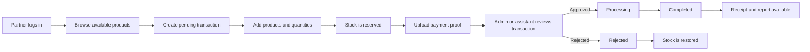
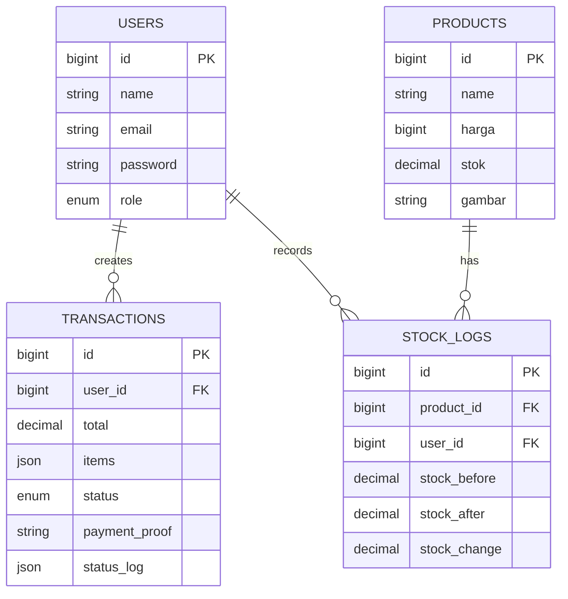

<div align="center">
  

# SIJASTA Transaction Management System

A role-based transaction, inventory, stock, and reporting application built with Laravel 10 and MySQL.

[](https://laravel.com)
[](https://www.php.net)
[](https://www.mysql.com)
[](https://github.com/sulthanrhnn/sijasta-transaction-management/actions/workflows/tests.yml)

</div>

## Overview

SIJASTA is a web application for managing products, stock, partners, transactions, payment proofs, transaction status history, receipts, and period-based reports. The system separates access for administrators, assistants, and partners.

This repository is a **sanitized portfolio edition**. Real operational records, credentials, uploaded payment proofs, personal data, company account details, and private configuration have been removed or replaced with dummy data.

## Main Features

- Authentication and session management
- Role-based route protection
- User and partner management
- Product and stock management
- Stock adjustment history
- Partner ordering workflow
- Transaction status workflow: `pending`, `diproses`, `selesai`, and `ditolak`
- Automatic stock reservation and restoration
- Payment-proof upload validation
- Transaction status audit log
- Date-range filtering
- PDF transaction reports
- Thermal receipt generation
- Responsive partner-facing pages
- Dummy seed data and demonstration accounts
- Automated feature tests through GitHub Actions

## User Roles

| Role | Main Access |
|---|---|
| **Admin** | Dashboard, users, partners, products, stock logs, transactions, reports |
| **Assistant** | Dashboard, partners, products, stock logs, transactions, reports |
| **Partner** | Product browsing, personal orders, payment upload, transaction history, receipts |

## Technology Stack

- PHP 8.1+
- Laravel 10
- MySQL
- Blade templates
- Bootstrap and AdminLTE
- JavaScript
- DomPDF
- PHPUnit
- GitHub Actions

## Application Flow



## Simplified Data Model



## Local Installation

### Requirements

- PHP 8.1 or newer
- Composer
- MySQL or MariaDB
- PHP extensions required by Laravel, including PDO MySQL, Mbstring, OpenSSL, Fileinfo, and DOM

### Setup

```bash
git clone https://github.com/sulthanrhnn/sijasta-transaction-management.git
cd sijasta-transaction-management
composer install
cp .env.example .env
php artisan key:generate
```

Create a MySQL database named `sijasta`, then update the database settings in `.env`:

```env
DB_CONNECTION=mysql
DB_HOST=127.0.0.1
DB_PORT=3306
DB_DATABASE=sijasta
DB_USERNAME=root
DB_PASSWORD=
```

Run the database migration and seed dummy data:

```bash
php artisan migrate --seed
```

Start the development server:

```bash
php artisan serve
```

Open `http://127.0.0.1:8000`.

## Demonstration Accounts

All accounts below use dummy data.

| Role | Email | Password |
|---|---|---|
| Admin | `admin@example.com` | `password` |
| Assistant | `assistant@example.com` | `password` |
| Partner | `partner@example.com` | `password` |

Change these credentials before using the application outside a local demonstration environment.

## Testing

The test configuration uses an in-memory SQLite database.

```bash
php artisan test
```

The included GitHub Actions workflow runs the test suite automatically on pushes and pull requests to `main`.

## Repository Structure

```text
app/                    Application controllers, middleware, and models
config/                 Laravel configuration
database/migrations/    Database schema
database/seeders/       Dummy demonstration data
docs/                   Portfolio documentation and screenshot checklist
public/                  Public assets and sanitized upload directories
resources/views/         Blade templates
routes/                  Web and API routes
tests/                   Feature and unit tests
```

## Security and Privacy

- `.env` is excluded from Git.
- Uploaded product images are excluded from Git, while payment proofs are stored in private application storage and served through an authorized route.
- The included accounts and records are fictional demonstration data.
- Real names, phone numbers, addresses, payment proofs, and bank details must not be committed.
- See [SECURITY.md](SECURITY.md) for reporting guidance.

## Portfolio Notes

This project demonstrates practical experience with:

- Laravel MVC architecture
- Relational database design
- Authentication and authorization
- Transaction-safe stock updates
- Server-side validation
- File uploads
- PDF generation
- Audit logs
- Automated testing and CI

## Author

**M. Sultan Raihan Attalla**  
Junior Web Developer / Software Engineer  
GitHub: [@sulthanrhnn](https://github.com/sulthanrhnn)
